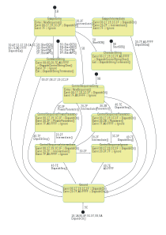

# Parser State Diagram

The parser implements the state machine shown here:

<!-- markdownlint-disable MD033 -->
<!-- The 'a' tag prevents the image from being a clickable link, -->
<!-- and allows the selection and copying of text within the image. -->

<!-- markdownlint-enable MD033 -->

Processing begins in the ground state at the bottom of the diagram, and the arrival of each character constitutes an event. Since the characters have 16-bit UTF-16 encodings, there are 2^16 possible events that can occur while the system is in any given state. In order to avoid any undefined behavior, the response of each state to all possible events is specified explicitly.

For legibility, each event is depicted as a hexadecimal number without any prefixes, representing the bit encoding of the character whose arrival triggered the event. In order to avoid explicitly writing out all 2^16 events for each state, ranges of character encodings are depicted as two hexadecimal numbers separated by a dash. Events shown within a state invoke the indicated actions, but they do not cause state transitions. Events shown on the directed lines between states trigger the indicated state transitions.

A directed line from a small solid circle to a state indicates that the listed events will cause an immediate unconditional transition to that state, regardless of what state the machine happens to be in at that time. On first glance, it might appear that the `CharacterString` state has no exit condition because there is no explicit directed line leading out of the state. However, the unconditional transitions just mentioned provide an exit mechanism for this state and all other states.

In addition to state transitions, events may trigger actions. These actions are shown after the events as the names of the corresponding methods in the state machine implementation. You can review the source code for the state machine to see the details of these actions.

States can also have entry and exit actions, indicated by the `Entry` and `Exit` keywords within the relevant states.
